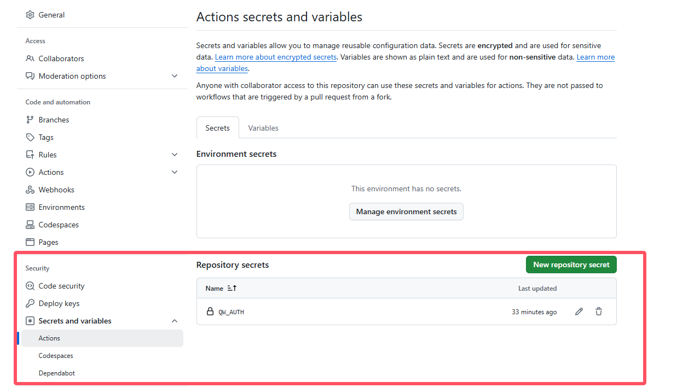

# WeCom-SeTu-Bot 企业微信色图机器人
## 项目简述
+ 简单的涩图转发： lolicon api => 镜像站 => 企业微信

## 食用方法
- fork 此仓库
- Secrets Actions 中添加 QW_AUTH 为对应的 api地址 即可（形如 "https://qyapi.weixin.qq.com/cgi-bin/webhook/send?key=xxxxx" ） 
- 可自行添加其他执行参数：
  - R18: 是否开启r18模式，默认为0，即不开启
  - TAGS: 关键词，默认为空
  - PIC_SIZE: 图片大小，默认为500
  - DIRECT_PROXY: 国内pixiv镜像代理站地址，不了解可不填